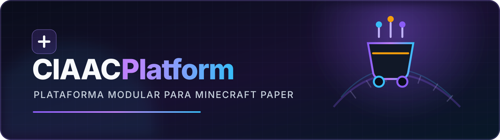
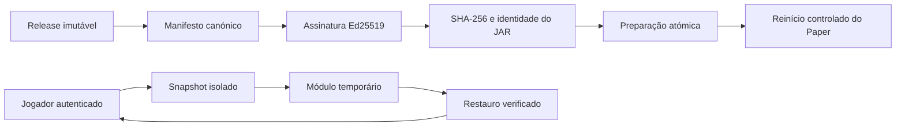

<div align="center">
  
</div>

<div align="center">

[](https://github.com/diogor0d/ciaac-platform/releases)
[](https://github.com/diogor0d/ciaac-platform/actions/workflows/ci.yml)


**Uma única plataforma. Módulos isolados. Operação segura por predefinição.**

[Transferir](https://github.com/diogor0d/ciaac-platform/releases) ·
[Explorar funcionalidades](#o-que-inclui) ·
[Configurar o atualizador](#atualizações-assinadas) ·
[Consultar a documentação](#mapa-da-documentação) ·
[Comunicar uma vulnerabilidade](SECURITY.md)

</div>

---

CIAACPlatform é o plugin Paper modular do **CIAAC — Universidade de Coimbra**.
Reúne minijogos, controlo de carrinhos, o Passaporte CIAAC e observabilidade
local num artefacto com fronteiras explícitas de autenticação, inventário,
economia e recuperação.

> [!IMPORTANT]
> A série `0.1.0-alpha` é experimental. A fonte e os testes automatizados estão
> verificados, mas a aceitação completa num servidor Paper descartável e a
> implantação em produção continuam **por verificar**.

## O que inclui

| | Área | O que entrega | Estado seguro inicial |
| :---: | --- | --- | --- |
| 🎮 | **Nove minijogos** | Coliseu, Build Battle, Batata Quente, Sumo, Parkour, Arco, Bigornas, Chão de Cores e Anéis de Elytra | Admissão fechada até validar integrações e mundos |
| 🛒 | **Carrinhos** | Limites por mundo e controlos temporários auditados para testes ao vivo | Desativado; não altera carrinhos de armazenamento |
| 🛂 | **Passaporte CIAAC** | Presenças, atividade, sequências, objetivos, recompensas e classificações | Desativado; adaptadores externos fechados |
| 🛡️ | **Isolamento e recuperação** | Snapshots de estado, quarentena, recuperação idempotente e proteção de progresso | Falha fechada perante estado incompleto |
| 📡 | **Eventos de segurança** | Envelopes locais, limitados e sem chamadas de rede | Apenas produção local de evidência |
| 🔏 | **Atualizador assinado** | Descoberta SemVer, Ed25519, SHA-256 e preparação atómica para o próximo reinício | Desativado; canal estável por predefinição |

## Princípios de segurança



- **Desativado primeiro:** módulos privilegiados ou dependentes do ambiente não
  arrancam apenas porque a configuração está incompleta.
- **Sem `/reload`:** atualizações e alterações de ciclo de vida exigem um
  reinício controlado.
- **Sem segredos no plugin:** o atualizador usa apenas uma chave pública fixada;
  a chave privada permanece no ambiente de publicação.
- **Sem progresso acidental:** inventário, equipamento, XP, efeitos, localização
  e integrações externas têm contratos explícitos de isolamento.
- **Evidência honesta:** compilação e testes não são apresentados como prova de
  execução Paper ou implantação.

## Instalação experimental

1. Abre a página de [Releases](https://github.com/diogor0d/ciaac-platform/releases).
2. Transfere exclusivamente `ciaac-platform.jar` da versão pretendida.
3. Confirma o SHA-256 publicado e conserva o manifesto e assinatura associados.
4. Coloca o JAR na pasta `plugins/` de uma instância **Paper descartável**.
5. Arranca com os módulos desativados e substitui apenas marcadores de
   configuração deliberadamente revistos.

Requisitos de compilação e execução de origem:

- JDK 25;
- Maven 3.9 ou posterior;
- Paper API `26.2.build.84-stable`;
- dependências opcionais apenas para os módulos que as declaram.

```text
mvn clean verify
```

> [!CAUTION]
> Não testes a primeira versão com mundos, inventários, contas ou bases de dados
> valiosos. Não uses `/reload` e não atives reinício automático sem um supervisor
> de processo previamente validado.

## Atualizações assinadas

O repositório `diogor0d/ciaac-platform` é a origem canónica das versões. Cada
release aceite pelo atualizador tem de ser imutável e conter exatamente:

```text
ciaac-platform.jar
ciaac-platform-update.properties
ciaac-platform-update.properties.sig
```

O atualizador está desligado por predefinição. A configuração pública já fixa o
repositório e a chave Ed25519 oficial; a ativação continua a ser uma decisão do
operador:

```yaml
updater:
  enabled: false
  github:
    owner: diogor0d
    repository: ciaac-platform
    allow-prereleases: false
  restart-empty-server-after-staging: false
```

`allow-prereleases: false` recebe apenas versões estáveis. Um servidor de teste
que deva receber alpha/beta tem de mudar explicitamente o valor para `true`.
Mesmo nesse canal, rascunhos, releases mutáveis, etiquetas ambíguas, assinaturas
inválidas, downgrades e caminhos inseguros são rejeitados.

[Ler o contrato técnico →](docs/release-updater.md) ·
[Ler o processo de publicação e recuperação →](docs/RELEASES.md)

## Mapa da documentação

| Quero… | Documento |
| --- | --- |
| perceber os módulos e navegar por funcionalidade | [Índice funcional](docs/README.md) |
| validar o contrato de uma release | [Atualizador e manifesto](docs/release-updater.md) |
| publicar, assinar ou recuperar uma versão | [Runbook de releases](docs/RELEASES.md) |
| rever dependências incluídas no JAR | [Avisos de terceiros](THIRD_PARTY_NOTICES.md) |
| comunicar um problema de segurança | [Política de segurança](SECURITY.md) |
| inspecionar permissões e comandos | [`plugin.yml`](src/main/resources/plugin.yml) |
| rever os valores seguros iniciais | [`config.yml`](src/main/resources/config.yml) |

## Estado verificável

| Fronteira | Estado em 2026-08-31 |
| --- | --- |
| Compilação JDK 25 e testes Maven | `SOURCE-VERIFIED` — 209 testes, 207 aprovados e 2 ignorados por dependerem do ambiente |
| CI pública no GitHub | `SOURCE-VERIFIED` — workflow em `main` aprovado |
| Conteúdo público sem dados operacionais | `SOURCE-VERIFIED` — payload analisado antes da publicação |
| Release assinada e descoberta pela API | consultar a [release publicada](https://github.com/diogor0d/ciaac-platform/releases) |
| Paper, nLogin, Multiverse, GrimAC e consumo do updater | `UNVERIFIED` |
| Implantação em produção | `UNVERIFIED` |

## Segurança e dados

Este repositório não deve conter mundos, dados de jogadores, bases de dados,
logs de produção, endereços privados, credenciais, tokens, certificados ou
chaves privadas. Se encontrares informação sensível, **não abras um issue
público**: segue a [política de comunicação privada](SECURITY.md).

## Licenciamento

A visibilidade pública deste repositório não concede, por si só, uma licença de
reutilização. Ainda não foi adotada uma licença de código aberto. Os componentes
de terceiros mantêm as respetivas licenças e avisos descritos em
[`THIRD_PARTY_NOTICES.md`](THIRD_PARTY_NOTICES.md).

---

<div align="center">
  <sub>Construído para a comunidade CIAAC, com limites operacionais explícitos e evidência verificável.</sub>
</div>
